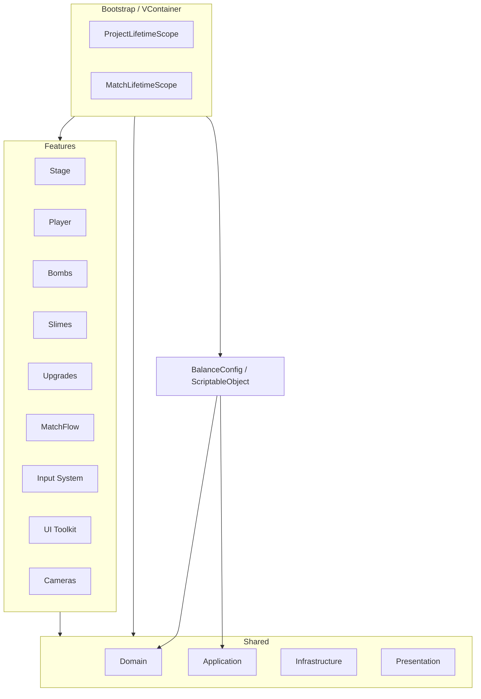
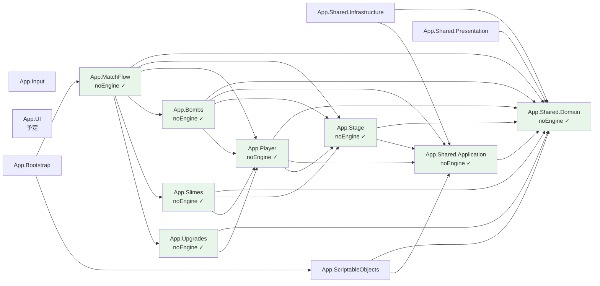
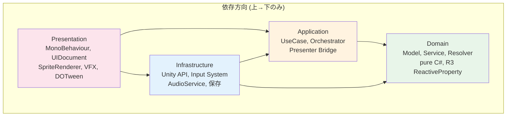
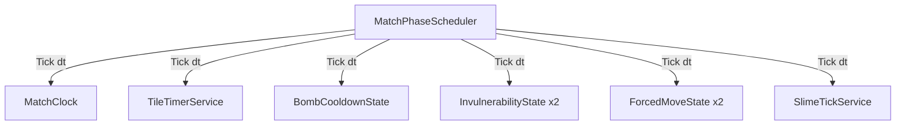
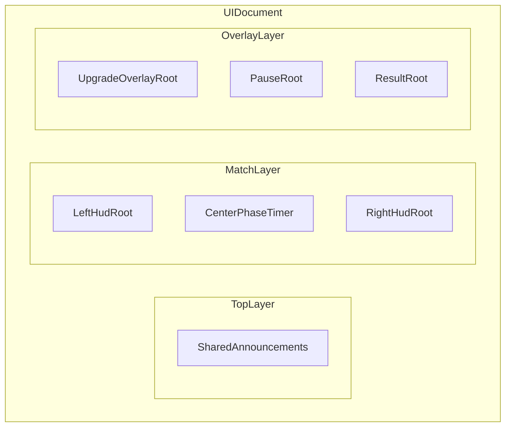
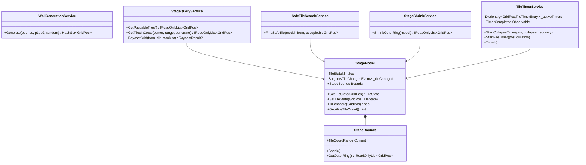
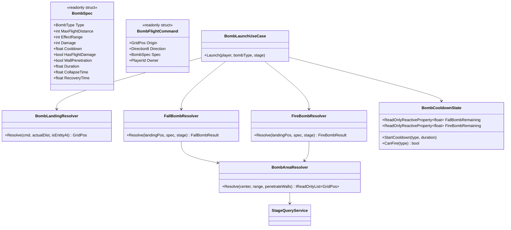
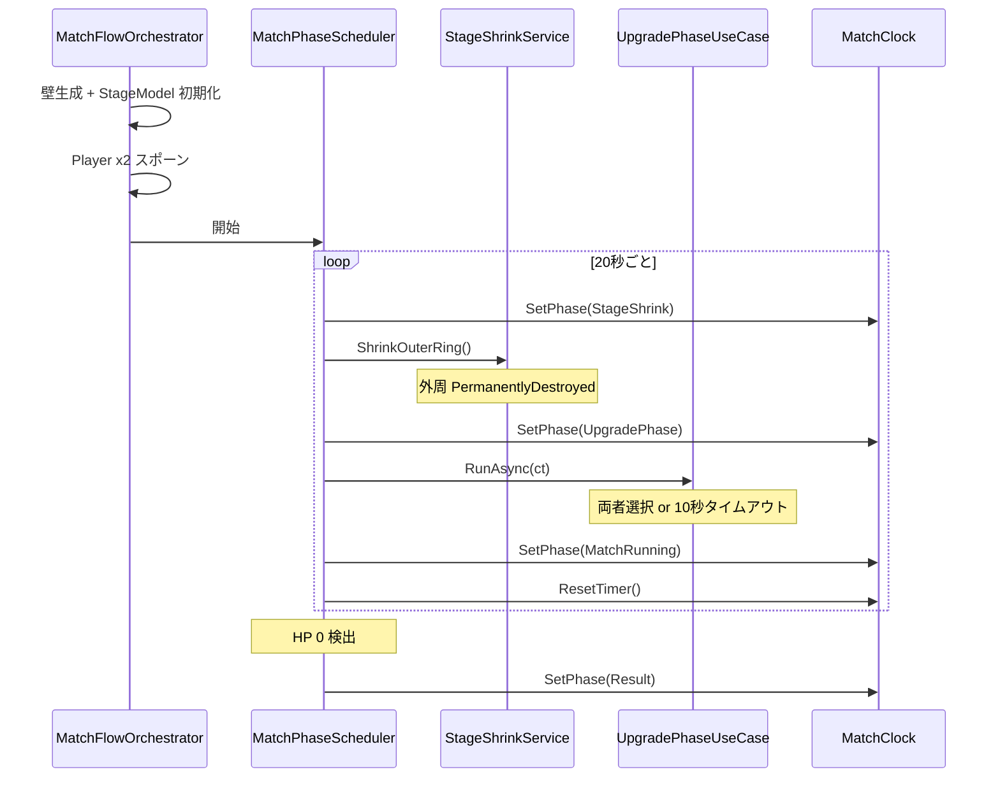
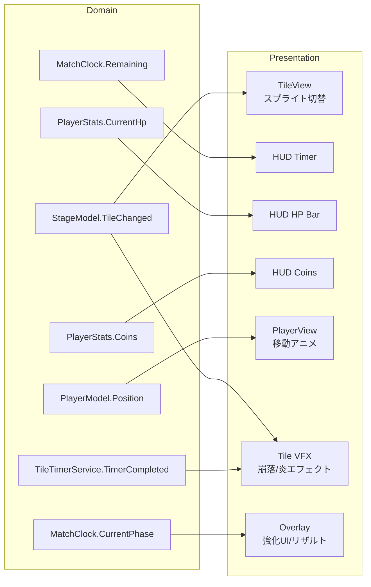

# FLOOR BREAKER — アーキテクチャ概要

## 全体構造



### Shared 内容

| レイヤー | クラス |
|---|---|
| Domain | GridPos, Direction8, CardinalDirection4, TileCoordRange, PlayerId, Float2, UpgradeId, GamePhase, MatchClock |
| Application | IBalanceParameters, ITimeProvider, IRandomProvider, IAudioService |
| Infrastructure | UnityTimeProvider, SeededRandomProvider |
| Presentation | Float2Extensions |

## アセンブリ依存グラフ



> 緑 = `noEngineReferences: true` (pure C# Domain)

## レイヤー構造



| レイヤー | 責務 | 例 |
|---|---|---|
| Domain | ゲームルール、モデル、サービス (pure C#, R3) | StageModel, PlayerBuild, BombSpec |
| Application | ユースケース、オーケストレーション | BombLaunchUseCase, PlayerMoveService |
| Infrastructure | Unity API ラッパー、外部実装 | UnityTimeProvider, InputAdapter, AudioService |
| Presentation | MonoBehaviour, UI, VFX, アニメーション | TileView, PlayerView, HUD Presenter |

## アーキテクチャ原則

### 時間管理の単一化

全ての時間進行は **MatchPhaseScheduler (Phase 7)** が唯一のドライバーとなる。



- 各サービスは自分でタイマーを持たず、外部から `Tick(float dt)` を受ける
- `MatchPhaseScheduler` が一時停止すると全ての Tick が止まる
- 独自の `Update()` や `InvokeRepeating` でタイマーを回すことを禁止

### Domain の公開面は read-only

Domain の `ReactiveProperty<T>` は private に閉じ、外部には `ReadOnlyReactiveProperty<T>` を公開する。

```
// 内部
private readonly ReactiveProperty<int> _currentHp;

// 公開
public ReadOnlyReactiveProperty<int> CurrentHp => _currentHp;
```

**適用済みの箇所**: StageModel.TileChanged, MatchClock.Remaining/CurrentPhase/IsPaused, PlayerStats.CurrentHp/Coins, PlayerModel.Position/FacingDirection, TileTimerService.TimerCompleted

**原則**: 状態を変更できるのは所有者のメソッドのみ。外部は購読だけ行う。

### UI Toolkit ルート戦略

Match 画面では **1 枚のフルスクリーン UIDocument** を使い、内部を領域分割する。



- パネルを増やさない（focus/navigation/sort order の複雑化回避）
- 左右 HUD は同一テンプレートを使う（P1/P2 で別実装にしない）
- オーバーレイの開閉は `display` / USS class 切り替えで制御
- 強化フェーズ中は gameplay input を凍結し、UI input のみ許可

---

## Feature 別クラス構成

### Stage



### Player


### Bombs



## マッチフロー ライフサイクル



## R3 Observable データフロー



## 実装進捗

| Phase | 内容 | Domain | Application | Infra/Pres | 状態 |
|---|---|---|---|---|---|
| 0 | 基盤 | — | — | asmdef, シーン, SO | **完了** |
| 1 | 共通プリミティブ | GridPos 等 | Interfaces | TimeProvider 等 | **完了** |
| 2 | ステージ | StageModel 等 7 クラス | — | — | **完了** |
| 3 | プレイヤー | PlayerModel 等 5 クラス | MoveService, DamageService | — | **完了** |
| 4 | ボム | BombSpec 等 8 クラス | BombLaunchUseCase | — | **完了** |
| 5 | スライム | SlimeModel 等 7 クラス | SlimeTickService | — | **完了** |
| 6 | 強化 | UpgradeDef 等 7 クラス | UpgradeApplyService | — | **完了** |
| 7 | マッチフロー | — | Scheduler, FireDmg 等 6 クラス | — | **完了** |
| 8 | 入力 | BombHoldCommand, BombFlightTracker | InputBridge | InputAdapter | **完了** |
| 8.5 | Phase 9 前提修正 | AcquiredUpgrades, Winner Observable | RemainingTime Observable | App.UI.asmdef | **完了** |
| 9 | UI | UpgradeSelectionState | — | UXML/USS/Presenter/View 10クラス | **完了** |
| 10 | ステージ Presentation | — | — | TileView, AnimService, VfxPool, Presenter 8クラス | **完了** |
| 11 | プレイヤー Presentation | — | — | PlayerView, AnimService, Presenter, Factory 7クラス | **完了** |
| 12-14 | Bomb/Slime/Camera Pres | — | — | View, VFX, Camera | 未着手 |
| 15 | Bootstrap | — | — | LifetimeScope | 未着手 |
| 16-18 | 統合/ポリッシュ | — | — | テスト, FX, SE | 未着手 |
