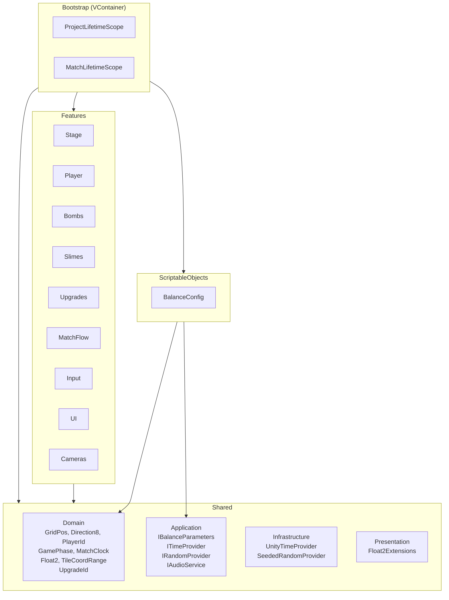
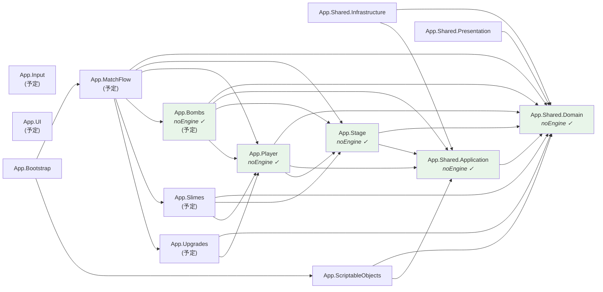
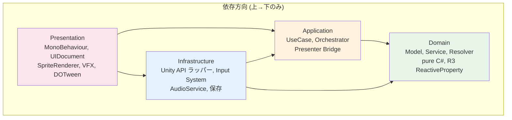
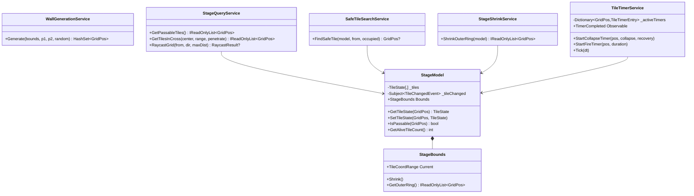
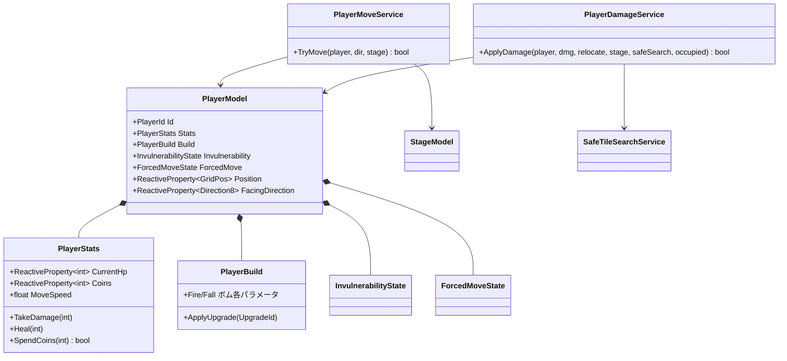
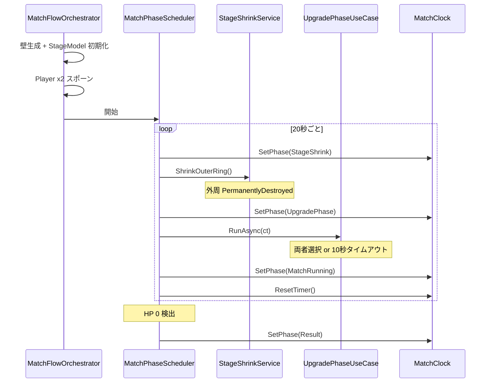
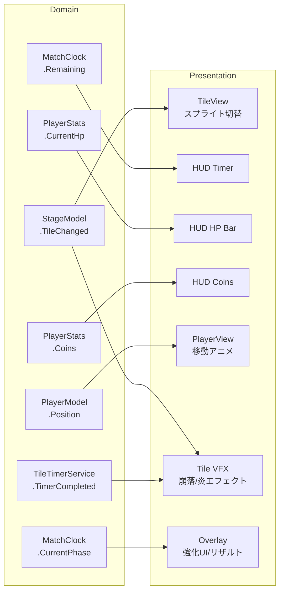

# FLOOR BREAKER — アーキテクチャ概要

## 全体構造

## アセンブリ依存グラフ

> 緑 = `noEngineReferences: true` (pure C# Domain)

## レイヤー構造

## Feature 別クラス構成

### Stage

### Player

### Bombs (Phase 4 予定)

## マッチフロー ライフサイクル

## R3 Observable データフロー

## 実装進捗

| Phase | 内容 | Domain | Application | Infra/Pres | 状態 |
|---|---|---|---|---|---|
| 0 | 基盤 | — | — | asmdef, シーン, SO | **完了** |
| 1 | 共通プリミティブ | GridPos 等 | Interfaces | TimeProvider 等 | **完了** |
| 2 | ステージ | StageModel 等 7 クラス | — | — | **完了** |
| 3 | プレイヤー | PlayerModel 等 5 クラス | MoveService, DamageService | — | **完了** |
| 4 | ボム | BombSpec 等 6 クラス | BombLaunchUseCase | — | **次** |
| 5 | スライム | SlimeModel 等 4 クラス | SlimeTickService | — | 未着手 |
| 6 | 強化 | UpgradeDef 等 6 クラス | UpgradeApplyService | — | 未着手 |
| 7 | マッチフロー | — | Orchestrator, Scheduler | — | 未着手 |
| 8 | 入力 | — | InputBridge | InputAdapter | 未着手 |
| 9 | UI | — | — | UXML/USS/Presenter | 未着手 |
| 10-14 | Presentation | — | — | View, VFX, Camera | 未着手 |
| 15 | Bootstrap | — | — | LifetimeScope | 未着手 |
| 16-18 | 統合/ポリッシュ | — | — | テスト, FX, SE | 未着手 |
